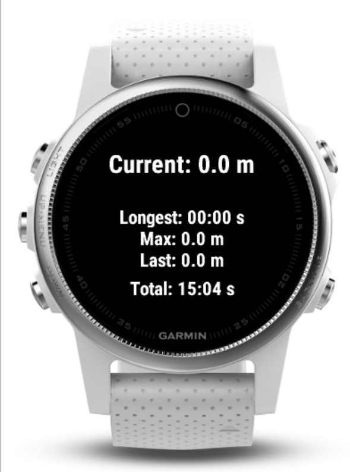

# Freediver (Connect IQ)

A personal freediving logger for Garmin watches that samples barometric pressure, converts it to **depth (m)**, detects dives, and records a **depth timeline** plus summary stats (**MaxDepth**, **LongestDive**). Data is written to the FIT file as **Connect IQ developer fields** so you can see a chart and summary in **Garmin Connect** when the app is installed from the Connect IQ Store (beta/private works).

> ⚠️ **Safety disclaimer**
> This is **not** a dive computer and must not be used for dive planning or safety-critical decisions. Intended for shallow, recreational use only.



---

## Features

* Depth computed from ambient pressure (zeroed at launch)
* Per-second timeline (depth) recorded to FIT
* Dive detection with hysteresis

  * `START_THRESH_M = 0.5 m`, `END_THRESH_M = 0.5 m`, `END_HOLD_MS = 2000`
* Summary metrics:

  * **MaxDepth\_m**
  * **LongestDive\_s**
* Simple on-watch display: current depth, longest dive, max depth, last dive peak, session duration

---

## Supported devices

* Developed for **fēnix 5** (CIQ ≥ 2.4).
* Any device exposing `Activity.Info.ambientPressure` or `rawAmbientPressure` should work.

---

## Permissions (manifest)

Make sure `manifest.xml` includes:

```xml
<iq:permissions>
  <iq:uses-permission id="Sensors"/>
  <iq:uses-permission id="Fit"/>
  <iq:uses-permission id="FitContributor"/>
</iq:permissions>
```

---

## Fit contributions (resources)

These enable Connect to render your chart/summary (IDs must match the code):

```xml
<resources>
  <strings>
    <string id="depth_label">Depth</string>
    <string id="depth_chart_title">Depth</string>
    <string id="depth_units">m</string>

    <string id="under_label">Underwater</string>
    <string id="under_units"></string>

    <string id="maxdepth_label">Max Depth</string>
    <string id="maxdepth_units">m</string>

    <string id="longest_label">Longest Dive</string>
    <string id="longest_units">s</string>
  </strings>

  <fitContributions>
    <fitField id="0"
      displayInChart="true"
      sortOrder="0"
      precision="1"
      chartTitle="@Strings.depth_chart_title"
      dataLabel="@Strings.depth_label"
      unitLabel="@Strings.depth_units"
      fillColor="#0080FF" />

    <fitField id="1"
      displayInChart="false"
      sortOrder="1"
      precision="0"
      dataLabel="@Strings.under_label"
      unitLabel="@Strings.under_units" />

    <fitField id="2"
      displayInActivitySummary="true"
      sortOrder="2"
      precision="1"
      dataLabel="@Strings.maxdepth_label"
      unitLabel="@Strings.maxdepth_units" />

    <fitField id="3"
      displayInActivitySummary="true"
      sortOrder="3"
      precision="0"
      dataLabel="@Strings.longest_label"
      unitLabel="@Strings.longest_units" />
  </fitContributions>
</resources>
```

---

## Build, debug, sideload, and release

### 1) Prerequisites

* **Garmin Connect IQ SDK** and **VS Code Monkey C extension**
* A **developer key** (VS Code → “Monkey C: Generate a Developer Key”)
* Garmin Connect Mobile (phone) or Garmin Express (desktop) for syncing

### 2) Build (VS Code)

* Command Palette → **Monkey C: Build for Device** → select your watch (e.g., *fēnix 5*).
  Output: `bin/<device>/yourapp.prg`

### 3) Debug (Simulator)

* VS Code → **Monkey C: Build** → **F5**
* Use **System.println** for logs, tweak thresholds live, etc.

### 4) Sideload (USB)

* Connect watch via USB.
* Copy `.prg` to `GARMIN/APPS/` on the device.
* Eject the device.

> You can run the sideloaded app for development, but **Garmin Connect won’t render** developer-field charts/summary unless the app is installed from the **Connect IQ Store** (beta/private listing is fine).

### 5) Use

* Launch the app at the **surface** (captures surface pressure).
* Dive as usual; the app records per-second depth.
* Exit the app to **stop & save** the FIT (the code also stops/saves in `App.onStop`).

### 6) Sync & view in Garmin Connect

* If installed via **Store (beta/private)**:

  * Open the activity → see a **Depth** chart and **summary fields** in the **Connect IQ / Developer Fields** section.
* If sideloaded only: export the FIT and view with **Monkey Graph** or a third-party site that shows developer fields.

---

## Exporting an `.iq` and using Monkey Graph

**Why:** Monkey Graph previews your developer fields/charts locally.

### Export the IQ package

* VS Code → **Monkey C: App Export Wizard** → choose output location → produces an **`.iq`**.

### Create a sample FIT (two options)

* Record a short session on the watch and **Export Original** from Garmin Connect (FIT), or
* Run in **Simulator**, then **File → Save FIT**.

### Open in Monkey Graph

* Launch **Monkey Graph** (from the SDK tools).
* Open both:

  1. Your **`.iq`** (chart/label schema),
  2. The recorded **`.fit`** (data).
* You should see your **Depth** timeline and summary values rendered exactly like Connect does.

---

## Releasing a beta/private build to the Connect IQ Store

1. Create a new app listing (unlisted/beta if you want to keep it private).
2. Upload the **`.iq`** (export wizard output), set min SDK/devices, icons, description, and **privacy disclaimers**.
3. Submit for **beta**.
4. Install to your watch from the store **(this step is what makes Connect display your developer fields)**.
5. Test, iterate, then promote if desired.

> Note on policy: Don’t claim to be a “dive computer” or provide decompression guidance. Keep it as a simple logger with clear safety disclaimers.

---

## Troubleshooting

* **No chart/summary in Connect:**

  * Ensure the app is **installed from the CIQ Store** (beta/private ok).
  * Check `resources.xml` `fitContributions` IDs match code constants.
  * Confirm you **stop & save** the session (a FIT must be finalized).
* **No pressure data:** some devices/activities restrict access; ensure it’s a **Watch App** (not a face/widget) and `Sensors` permission is present.
* **Laggy depth or shallow peaks:** barometric stream is filtered; consider slightly lower start threshold or longer hold.
* **Freshwater:** set `RHO = 1000.0`.

---

## Roadmap (nice-to-haves)

* Toggle **sea/fresh** on-watch
* Haptic alerts at target depth/time
* CSV export to `/GARMIN/APPS/DATA/`

---

## License

Personal use only; no warranty. Not a safety device.
